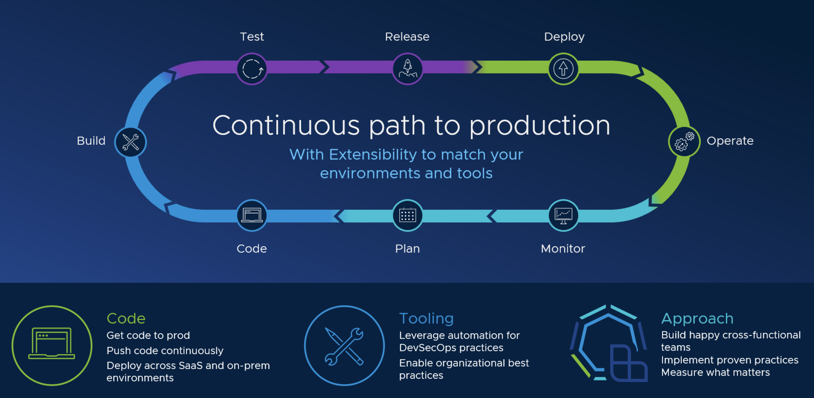

# Tanzu Application Platoform
## _Service operators (RabbitMQ, Postgres)_

As part of Tanzu Application Platform, you can work with backing services such as RabbitMQ, PostgreSQL, and MySQL among others. Binding application workloads to service instances is the most common use of services.

### The scripts in this repository automate the deployment of the following service operators.
- [RabbitMQ Operator](https://docs.vmware.com/en/VMware-Tanzu-Application-Platform/1.2/tap/GUID-getting-started-set-up-services.html)
- [Postgres Operator](https://docs.vmware.com/en/VMware-Tanzu-SQL-with-Postgres-for-Kubernetes/1.9/tanzu-postgres-k8s/GUID-install-operator.html)
