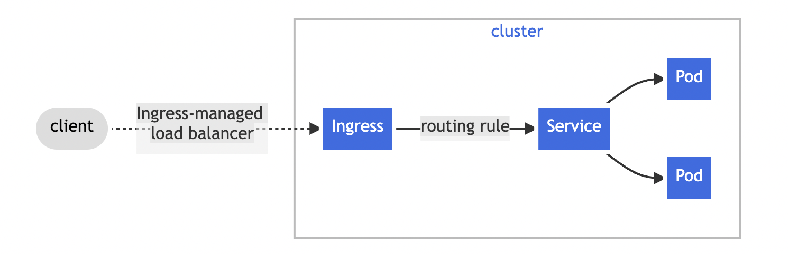

#### Nginx Ingress Controller

[Ingress](https://kubernetes.io/docs/reference/generated/kubernetes-api/v1.25/#ingress-v1-networking-k8s-io)  exposes HTTP and HTTPS routes from outside the cluster to  [services](https://kubernetes.io/docs/concepts/services-networking/service/)  within the cluster. Traffic routing is controlled by rules defined on the Ingress resource.

Here is a simple example where an Ingress sends all its traffic to one Service:

