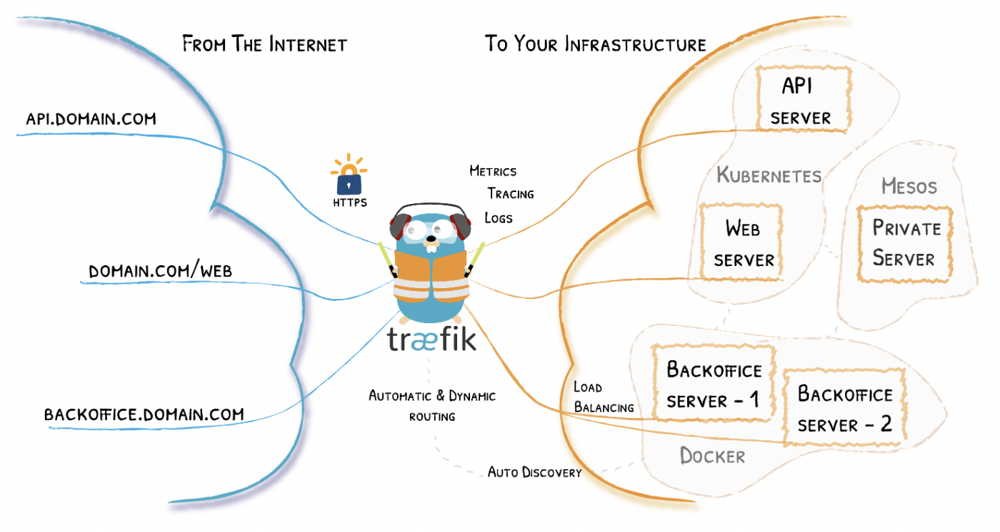

#### Traefik Proxy

Traefik is a leading modern reverse proxy and load balancer that makes deploying microservices easy. Traefik integrates with your existing infrastructure components and configures itself automatically and dynamically.

Traefik is designed to be as simple as possible to operate, but capable of handling large, highly-complex deployments across a wide range of environments and protocols in public, private, and hybrid clouds. It also comes with a powerful set of middlewares that enhance its capabilities to include load balancing, API gateway, orchestrator ingress, as well as east-west service communication and more.




#### Install FluentBit
```bash
# install FluentBit in k8s cluster
git clone https://github.com/pivotal-ben-chacko/Tanzu-Kubernetes-Grid.git
cd Tanzu-Kubernetes-Grid/graylog
tanzu package install fluent-bit --package-name fluent-bit.tanzu.vmware.com --version 1.8.15+vmware.1-tkg.1 --values-file fluent-bit-data-values.yaml --namespace tanzu-packages

# verify FluentBit is installed and running
kubectl get all -n tanzu-system-logging
NAME                   READY   STATUS    RESTARTS   AGE
pod/fluent-bit-2h96b   1/1     Running   0          3h10m
pod/fluent-bit-5n9pj   1/1     Running   0          3h10m
pod/fluent-bit-fbfkx   1/1     Running   0          3h10m
pod/fluent-bit-fvt6r   1/1     Running   0          3h10m
pod/fluent-bit-gtfmh   1/1     Running   0          3h10m
pod/fluent-bit-rs9xt   1/1     Running   0          3h10m
pod/fluent-bit-xq8bp   1/1     Running   0          3h10m
```
</br>

#### Links

* Traefik Proxy: [https://doc.traefik.io/traefik/](https://doc.traefik.io/traefik/)

* Graylog VM Install: [https://graylog2zh-cn.readthedocs.io/zh_CN/latest/pages/installation/virtual_machine_appliances.html](https://graylog2zh-cn.readthedocs.io/zh_CN/latest/pages/installation/virtual_machine_appliances.html)

* Graylog OVA appliance: [https://github.com/Graylog2/graylog2-images](https://github.com/Graylog2/graylog2-images)


